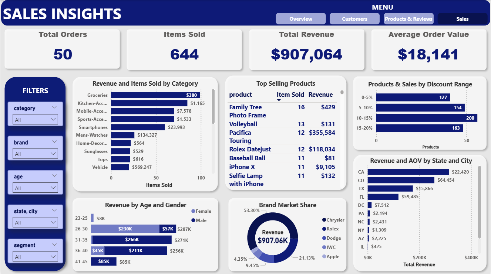

# Data-Warehouse-and-Data-Analysis-Project

This project presents a comprehensive demonstration of modern data warehouse and analytics solutions. It includes end-to-end data processes featuring API-based data extraction, ETL procedures, data warehouse design, and visualization with Power BI.

# Part 1: Data Warehouse Implementation 

You can find the script used to create database and schemas in [here](scripts/init_database.sql)

## 🏗️  Data Architecture

This project adopts the Medallion Architecture approach (Bronze, Silver Preparation, Silver, Gold layers):

* **Bronze Layer:** Stores raw data extracted from APIs as-is

You can find scripts used to create bronze layer in [here](scripts/bronze/ddl_bronze.sql)

* **Silver Preparation Layer:** Flattens nested JSON structures and arrays from the Bronze layer into normalized columns

You can find scripts used to create silver preperation layer in [here](scripts/silver_prep/ddl_silver_prep.sql)

* **Silver Layer:** Contains data cleansing, standardization, and normalization processes

You can find scripts used to create silver layer in [here](scripts/silver/ddl_silver.sql)

You can find script to load data into silver layer in [here](scripts/silver/silver_load_process.sql)

* **Gold Layer:** Business-ready data structured in star schema model for reporting and analytics

You can find scripts used to create gold layer in [here](scripts/gold/ddl_gold.sql)

## 🎯 Project Scope

This project includes:

* **API-Based Data Extraction:** Data collection from DummyJSON API using Python

* **ETL Pipeline:** Extract, Transform, and Load processes using user defined functions with python

* **Data Modeling:** Development of fact and dimension tables optimized for analytical queries

* **SQL Server Data Warehouse:** Modern data warehouse architecture setup

* **Power BI Analytics:** Business intelligence and visualization solutions

## 🛠️ Technology Stack

* **Python:** For data extraction and ETL processes

  * **requests:** API calls
  * **pandas:** Data manipulation
  * **sqlalchemy:** Database connections

* **SQL Server:** Data warehouse platform
* **Power BI:** Business intelligence and visualization

## 🔄 ETL Process

The ETL process is implemented using Python. 

You can access the detailed ETL process in [here](scripts/etl/etl_data_warehouse.ipynb) and functions used in the ETL process [here](scripts/etl/etl_functions.py).

### Extract - Python API Integration

Data is extracted from DummyJSON API endpoints including products, users, and carts using the requests library.

### Transform - Data Processing with Python

Raw extracted data is processed using Python to flatten nested JSON structures and arrays into normalized table format.

### Load - SQL Server Integration
   
Processed data is loaded into appropriate layers in SQL Server.

## 🗂️ Entity Relationship Diagram

### The star schema consists of:

* **fact_orders:** Central fact table containing order transactions and metrics
* **dim_customers:** Customer dimension with detailed customer information
* **dim_products:** Product dimension with product specifications and attributes
* **dim_reviews:** Review dimension containing product reviews and ratings

### Key relationships:

* Each order in **fact_orders** references a customer through `customer_id`
* Each order line references a product through `product_id`
* Reviews are linked to both customers and products for comprehensive analysis

## 🔍 Data Quality and Validation

Comprehensive data quality checks are implemented across both silver and gold layers to ensure data integrity and consistency. The validation process includes duplicate detection, referential integrity verification, business rule validation (such as price and quantity constraints), and format compliance checks for fields like SKUs, emails, and URLs. These quality assurance measures guarantee that the data warehouse maintains high standards of accuracy and reliability throughout the ETL pipeline.

You can find quality and validation tests runned in silver layer in [here](tests/quality_check_silver.sql)

You can find quality and validation tests runned in gold layer in [here](tests/quality_check_gold.sql)

# Part 2: Analytics & Insights 📊

The Power BI analytics implementation provides comprehensive insights into the e-commerce business performance through interactive dashboards. Insights and recommendations are provided on the following key areas:

* **👥 Customer Demographics and Segmentation:** A detailed breakdown of customer demographics and behavior patterns, including segmentation based on spending levels to identify high-value customer groups and retention opportunities.

* **📦 Products and Reviews:** An analysis of product performance across different categories, customer satisfaction ratings, and review patterns to understand product popularity and customer feedback trends.

* **💰 Sales Performance:** An evaluation of sales metrics including revenue distribution, order patterns, and geographic performance to identify key business drivers and market opportunities.

You can find the full interactive dashboard in [here](dashboard.pbix)  

## Overview of Findings

The e-commerce analytics revealed performance with $907.06K in total revenue generated from 208 customers across 50 orders, resulting in 644 items sold during the analyzed period. The business demonstrates customer engagement with a 21.63% active buyer rate, though the low 1.92% repeat buyer percentage indicates significant opportunities for customer retention improvement. Geographic performance shows concentrated revenue generation with Denver leading at 28.42% of total revenue, while product analysis reveals vehicles as the dominant category contributing 62.76% of total sales. Customer segmentation analysis highlights the value of premium customers, with platinum tier customers generating $456K in revenue, significantly outperforming other segments and emphasizing the importance of high-value customer retention strategies.

## Customer Demographics and Segmentation

* **Gender Distribution:** The customer base demonstrates balanced gender representation with females slightly leading at 50.96% (106 customers) compared to males at 49.04% (102 customers), indicating broad market appeal across both demographics with near-perfect gender parity.

* **Customer Activity Patterns:** Active customer analysis reveals that 55.56% of customers are male and 44.44% are female among the 45 active customers, with an impressive average customer value of $20,157, demonstrating the high-value nature of the engaged customer base.
  
* **Age Demographics and Activity Patterns:** The 26-30 age group represents the dominant customer segment with the highest revenue generation and leads active customer engagement with 17 active customers, followed by the 31-35 age group with 15 active customers, indicating that millennials in their prime earning years constitute the core customer demographic for high-value purchases and drive the majority of business activity.
  
* **Geographic Distribution:** Customer distribution shows strong presence across major US states, with California leading the customer count at 43 customers, followed by significant representation in Arizona, Texas, Florida, and other key markets, demonstrating effective nationwide market penetration.
  
* **Professional Demographics:** The customer base spans diverse professional backgrounds with Project Managers leading at 14 customers, followed by Business Analysts, Legal Counsels, and Web Developers each contributing 12 customers, indicating strong appeal among skilled professionals and knowledge workers.
  
* **Customer Segmentation Effectiveness:** The tiered segmentation strategy reveals a pyramid structure with Inactive customers representing the largest group at 163 customers (86 female, 77 male), followed by Bronze segment with 22 customers (9 female, 13 male), Silver with 11 customers (6 female, 5 male), Gold with 8 customers (4 female, 4 male), and Platinum representing the premium tier with 4 customers (1 female, 3 male), indicating significant opportunities for customer activation and progression strategies across segments.
  
* **High-Value Customer Profile:** Top revenue generators include Carter Baker with $246,877 from 3 orders and Nora Mills with $134,662 from 2 orders, demonstrating the significant impact of individual high-value customers and the importance of premium customer retention strategies for business growth.

## Products and Reviews

* **Product Portfolio and Overall Performance:** The analysis reveals a well-diversified portfolio with 194 products across 24 categories and 64 different brands. The gap between expected rating (3.80) and actual rating (3.69) of -0.11 indicates that customer expectations are generally being met, though there's room for fine-tuning performance.

* **Category Sales Distribution and Opportunities:** Kitchen-Accessories leads with 30 units sold, followed by Groceries (27 units), forming the core of successful categories. Sports-Accessories (17) and Smartphones (16) show moderate performance with growth potential. The lowest-performing categories are Women's Jewelery, Tablets, and Skin-Care, indicating either market saturation or product-market fit issues that require strategic attention.

* **Critical Stock Issues:** The inventory situation shows mixed challenges across product demand levels: Samsung Galaxy S8, Sportbike Motorcycle, and Volleyball Watch are completely out of stock (0 units) after selling 3, 2, and 10 units respectively. Meanwhile, other products face low stock situations - Apple Airpower and Apple MagSafe Battery Pack maintain only 1 unit each despite selling 1 and 7 units. This indicates inadequate demand forecasting across different product tiers, with both stockout and low-stock scenarios affecting sales potential.

* **Rating Performance and Customer Dissatisfaction:** Of the 133 different products sold, 62 products have received ratings below their expected levels which reveals widespread quality concerns affecting nearly half the product portfolio, indicating systemic quality issues. To give an example, products with IDs 5, 6, and 11 show severe rating gaps with expected ratings of 4.32-4.77 versus actual ratings of only 2.00.

* **Inventory Management Challenges:** Multiple overstocked items are consuming valuable storage space and tying up working capital. Products like Heshe Women's Leather Bag (99 units in stock), Durango SXT (95 units), RWD Feather Shuttlecock (95 units), and Men Check Shirt (95 units) represent slow-moving inventory with poor sales velocity. These products are generating minimal turnover while occupying substantial warehouse capacity. Price adjustments and discount strategies may need to be considered for these overstocked items to improve inventory flow and free up storage resources.

## Sales Performance

* **Overall Sales Performance:** The marketplace generated $907,064 in total revenue from 50 orders encompassing 644 items sold, resulting in an impressive average order value of $18,141. This high AOV indicates strong premium product positioning and successful upselling strategies.

* **Category Performance and Revenue Distribution:** Vehicle category dominates revenue generation with $569,247 despite lower unit sales, indicating high-value transactions. Mens-Watches follows with $134,327 revenue, while Smartphones generated $23,993. Groceries shows high volume with approximately 100 units sold but only $380 revenue, revealing a low-margin, high-frequency category. Kitchen-Accessories achieved $1,165 revenue with moderate sales volume, while Mobile-Accessories ($7,578) and Sports-Accessories ($1,533) demonstrate mid-tier performance.

* **Top-Selling Products Analysis:** Family Tree Photo Frame leads with 16 units sold generating $429 revenue. Volleyball (13 units, $131) and Pacifica Touring (12 units, $355,584) show contrasting patterns - high volume/low value versus premium pricing strategy. Rolex Datejust (12 units, $118,034) and iPhone X (11 units, $9,105) represent luxury segments driving significant revenue per unit.

* **Discount Strategy Effectiveness:** The discount distribution reveals balanced pricing strategies across different ranges: 0-5% discount range achieved 127 units sold across 41 different products, while 5-10% range generated 154 units from 49 products, and 10-15% range peaked at 200 units across 56 products. The 15-20% range includes 163 units sold from 48 different products, suggesting moderate to aggressive discounting is driving volume sales effectively while maintaining product diversity.

* **Demographic Revenue Patterns:** The age-gender distribution shows distinct spending patterns: The 26-30 segment generates $287K total revenue with strong female dominance ($230K female vs $57K male). The 31-35 age group produces $271K total revenue with male preference ($266K male vs $5K female). The 36-40 demographic contributes $256K total revenue with male majority ($211K male vs $45K female). Younger demographics (23-25) show minimal engagement with $8K from females only, while the 41-45 group generates $85K exclusively from male customers.

* **Brand Market Share Distribution:** The brand portfolio shows significant market concentration with Chrysler dominating at 53.3% market share, followed by Rolex at 21.13%. Dodge captures 9.45% of the market, while IWC holds 4.35% and Apple maintains 2.4%. These five major brands control over 90% of the total market share, indicating a highly concentrated marketplace with limited brand diversification. This concentration suggests both the strength of established premium brands and potential opportunities for emerging brand partnerships.

* **Geographic Revenue and AOV Analysis:** California leads the marketplace with $314K total revenue and $22K average order value, while Colorado achieves the highest customer value at $64K AOV from $258K revenue, indicating premium market positioning. Texas ($175K revenue, $16K AOV) and Florida ($119K revenue, $59K AOV) represent strong secondary markets with solid performance. At the city level, Denver ($258K revenue, $64K AOV) and San Jose ($174K revenue, $35K AOV) drive the majority of sales, while smaller markets like Chicago ($425), Indianapolis ($206), and Seattle ($35) show minimal penetration, representing significant untapped growth opportunities.

